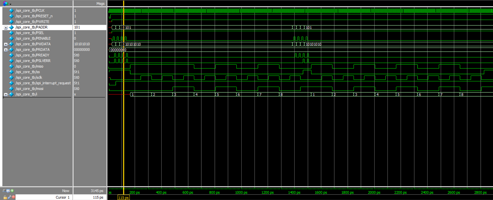
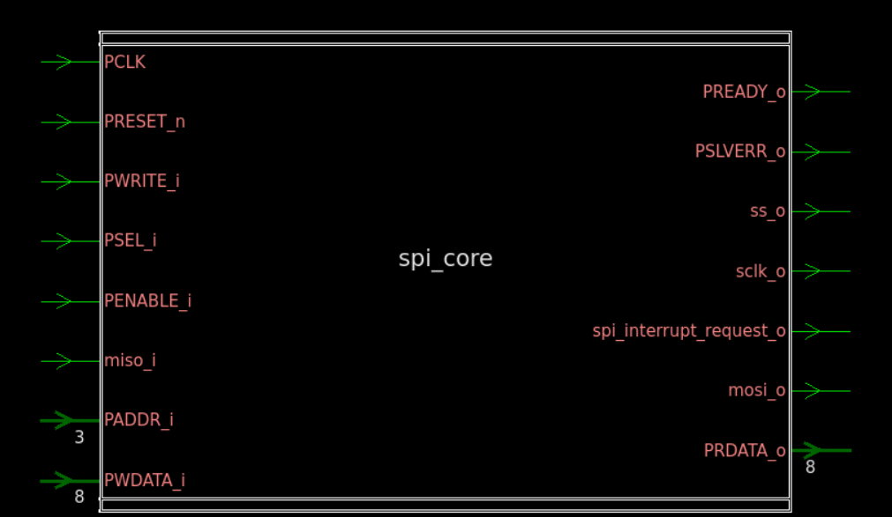
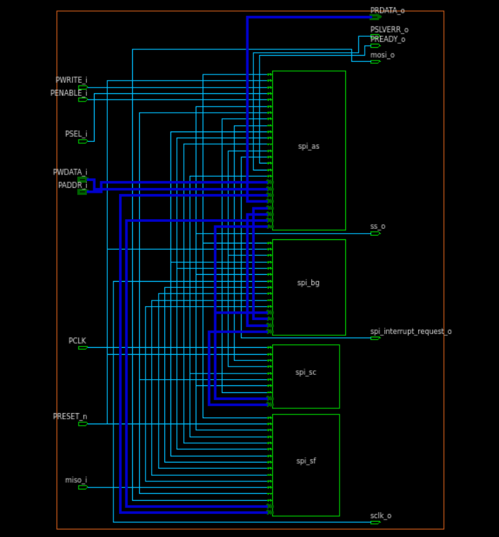

# 🚀 APB-SPI Master

## 📌 Project Overview

This project implements an **APB-controlled SPI Master** using **Verilog HDL**.

The design acts as a bridge between an **AMBA APB interface** and an **SPI Master datapath**, allowing an APB master to configure the SPI controller, initiate serial transfers, transmit data through MOSI, and receive data through MISO.

The RTL follows a **modular and synthesizable architecture** and has been verified through **module-level simulation, waveform analysis, RTL debugging, and synthesis using Synopsys Design Compiler**.

---

## 🎯 Design Objectives

- Implement an APB slave interface for SPI register access
- Implement SPI Master control and data-transfer logic
- Generate SPI `SCLK` using programmable baud-rate control
- Implement SPI Slave Select (`SS`) control
- Implement serial TX/RX data shifting
- Support configurable SPI clock polarity and phase
- Support configurable MSB-first / LSB-first operation
- Implement SPI status and interrupt logic
- Develop module-level Verilog testbenches
- Verify APB and SPI functionality through simulation
- Perform RTL synthesis and analyze the generated netlist

---

## 🏗️ RTL Architecture

```text
                         APB MASTER / CPU
                                |
                                | APB
                                v
                   +---------------------------+
                   |   APB Interface Logic     |
                   |                           |
                   | PSEL / PENABLE            |
                   | Address Decode            |
                   | Read / Write Control      |
                   | Register Access           |
                   +-------------+-------------+
                                |
                           Control / Data
                                |
                                v
                   +---------------------------+
                   |        SPI CORE            |
                   |                           |
                   | +-----------------------+ |
                   | | Baud Rate Generator   | |
                   | |      SPPR / SPR      | |
                   | +-----------+-----------+ |
                   |             |             |
                   |            SCLK           |
                   |                           |
                   | +-----------------------+ |
                   | |    SPI Shifter        | |
                   | |      TX / RX          | |
                   | +-----------+-----------+ |
                   |             |             |
                   |          MOSI/MISO        |
                   |                           |
                   | +-----------------------+ |
                   | | Slave Select Control  | |
                   | +-----------+-----------+ |
                   +-------------+-------------+
                                |
                                v
                          SPI Peripheral
```

---

## 🧩 RTL Modules

| Module | Technical Function |
|---|---|
| `spi_core.v` | Integrates SPI control, datapath, clock generation, and status logic |
| `spi_apb_interface.v` | Implements APB transaction handling, address decoding, and register access |
| `spi_shifter.v` | Implements parallel-to-serial TX and serial-to-parallel RX shifting |
| `spi_slave_select.v` | Generates and controls SPI Slave Select timing |
| `spi_baud_generator.v` | Generates programmable SPI serial clock from the system clock |

The RTL is partitioned into **bus interface, control, clock-generation, datapath, and peripheral-interface logic**.

---

## 🔌 APB Interface

The SPI Master is controlled through an **AMBA APB slave interface**.

### APB Signals

| Signal | Description |
|---|---|
| `PCLK` | APB/system clock |
| `PRESET_n` | Active-low reset |
| `PADDR` | APB address |
| `PWRITE` | Read/write direction |
| `PSEL` | Peripheral select |
| `PENABLE` | APB access-phase control |
| `PWDATA` | APB write data |
| `PRDATA` | APB read data |
| `PREADY` | APB transfer completion |
| `PSLVERR` | APB error indication |

### APB Transaction

```text
             SETUP                 ACCESS
               |                     |
PSEL       ____|‾‾‾‾‾‾‾‾‾‾‾‾‾‾‾‾‾‾
PENABLE    ____________|‾‾‾‾‾‾‾‾‾‾‾
PADDR      ---- Valid Address --------
PWRITE     ---- Valid Control --------
PWDATA     ---- Valid Write Data -----
PREADY     _________________|‾‾‾‾‾‾‾
```

The APB interface performs:

- Address decoding
- Read/write detection
- Register selection
- Write-data capture
- Read-data multiplexing
- APB transfer completion

---

## 🗂️ Register Map

The SPI controller exposes configuration, status, and data registers through the APB interface.

| Address | Register | Access | Function |
|---|---|---|---|
| `3'b000` | `SPI_CR_1` | R/W | SPI primary control |
| `3'b001` | `SPI_CR_2` | R/W | SPI secondary control |
| `3'b010` | `SPI_BR` | R/W | Baud-rate configuration |
| `3'b011` | `SPI_SR` | R | SPI status |
| `3'b101` | `SPI_DR` | R/W | Transmit/receive data |

---

## 🎛️ SPI Control Configuration

The primary control register provides configuration for the SPI operating mode.

```text
+------+------+------+------+------+------+------+------+
| SPIE | SPE  | SPTIE| MSTR | CPOL | CPHA | SSOE | LSBFE|
+------+------+------+------+------+------+------+------+
   7      6      5      4      3      2      1      0
```

| Bit | Field | Function |
|---|---|---|
| 7 | `SPIE` | SPI interrupt enable |
| 6 | `SPE` | SPI module enable |
| 5 | `SPTIE` | SPI transmit interrupt enable |
| 4 | `MSTR` | Master mode selection |
| 3 | `CPOL` | Clock polarity |
| 2 | `CPHA` | Clock phase |
| 1 | `SSOE` | Slave Select output enable |
| 0 | `LSBFE` | LSB-first enable |

Additional SPI control is provided through `SPI_CR_2`, including Mode Fault and SPI wait-state related control.

---

## ⏱️ Baud Rate Generation

The `spi_baud_generator.v` module generates the SPI serial clock from the system clock.

The baud-rate configuration is controlled using:

```text
SPPR
SPR
```

The programmed values determine the clock division used to generate `SCLK`.

```text
                     System Clock
                          |
                          v
                 +-------------------+
                 | Baud Rate         |
                 | Generator         |
                 |                   |
                 | SPPR / SPR        |
                 | Counter Logic     |
                 +---------+---------+
                           |
                           v
                          SCLK
```

The generated `SCLK` is used by the SPI control and shifting logic to establish serial transfer timing.

---

## 🔄 SPI Serial Datapath

The `spi_shifter.v` module implements the SPI transmit and receive datapath.

### Transmit

```text
APB PWDATA
    |
    v
SPI Data Register
    |
    v
TX Shift Register
    |
    v
  MOSI
```

### Receive

```text
  MISO
    |
    v
RX Shift Register
    |
    v
SPI Data Register
    |
    v
APB PRDATA
```

The shifter performs the required **parallel-to-serial and serial-to-parallel conversion** during an SPI transaction.

---

## 🔢 Bit Ordering

The SPI Master supports configurable bit ordering.

### MSB First

```text
Bit[7] → Bit[6] → Bit[5] → Bit[4]
       → Bit[3] → Bit[2] → Bit[1] → Bit[0]
```

### LSB First

```text
Bit[0] → Bit[1] → Bit[2] → Bit[3]
       → Bit[4] → Bit[5] → Bit[6] → Bit[7]
```

The `LSBFE` control bit selects the required transfer direction.

---

## 🎚️ SPI Clock Configuration

SPI timing is controlled using `CPOL` and `CPHA`.

| Mode | CPOL | CPHA |
|---|---|---|
| 0 | 0 | 0 |
| 1 | 0 | 1 |
| 2 | 1 | 0 |
| 3 | 1 | 1 |

### CPOL

```text
CPOL = 0 → SCLK idle LOW
CPOL = 1 → SCLK idle HIGH
```

### CPHA

`CPHA` determines the clock phase used for sampling and shifting serial data.

Together, `CPOL` and `CPHA` determine the SPI clock/data timing mode.

---

## 🔴 Slave Select Control

The `spi_slave_select.v` module controls the SPI Slave Select (`SS`) signal.

A typical SPI transaction follows:

```text
Idle
  |
  v
Transfer Request
  |
  v
SS Asserted
  |
  v
SCLK Generation
  |
  v
Serial Data Transfer
  |
  v
Transfer Complete
  |
  v
SS Deasserted
  |
  v
Idle
```

`SS` defines the active SPI transaction window for the external slave device.

---

## 🚨 SPI Status Logic

The SPI Status Register provides information about the current SPI operation.

| Status | Description |
|---|---|
| `SPIF` | Indicates SPI transfer/receive completion status |
| `SPTEF` | Indicates transmit-data register status |
| `MODF` | Indicates SPI Mode Fault condition |

The status signals can be accessed through APB register reads.

---

## ⚠️ Mode Fault Detection

The design includes **SPI Mode Fault detection** for Master-mode operation.

Mode Fault handling is associated with:

- Master mode
- Slave Select control
- Mode Fault enable
- SPI output configuration

A detected Mode Fault condition updates the corresponding status indication.

---

## 🔔 Interrupt Logic

The SPI controller generates:

```text
spi_interrupt_request_o
```

Interrupt generation is controlled through SPI interrupt-enable configuration and relevant SPI status conditions.

This provides a mechanism for the APB-connected processor to respond to SPI events without continuously polling the peripheral.

---

## 🔁 Complete SPI Transfer

The APB-controlled SPI transaction can be summarized as:

```text
APB Configuration
       |
       v
SPI Register Write
       |
       v
Write TX Data to SPI_DR
       |
       v
Transfer Initiation
       |
       v
SS Assertion
       |
       v
SCLK Generation
       |
       v
MOSI TX / MISO RX
       |
       v
8-bit Serial Transfer
       |
       v
Transfer Completion
       |
       v
SS Deassertion
       |
       v
Status Update
       |
       v
RX Data Available
```

---

## 🧪 Verification

The design was verified using **Verilog-based module-level testbenches**.

### Testbenches

```text
tb/
├── spi_core_tb.v
├── spi_shifter_tb.v
├── spi_slave_select_tb.v
├── spi_baud_generator_tb.v
└── spi_apb_interface_tb.v
```

### Verification Areas

- APB setup and access phases
- APB read/write transactions
- Register address decoding
- Reset behavior
- SPI configuration
- SPI transfer initiation
- SCLK generation
- Baud-rate operation
- Slave Select timing
- MOSI transmission
- MISO reception
- 8-bit serial transfer
- CPOL/CPHA operation
- MSB/LSB-first operation
- Status flag behavior
- Mode Fault behavior
- Interrupt behavior

The MISO signal is driven in the testbench to model the response of an external SPI slave.

---

## 📊 Simulation Waveform

The functional simulation waveform demonstrates the interaction between the APB control interface and SPI serial interface.



The waveform is used to analyze:

- APB transaction sequencing
- Register access
- SPI configuration
- Slave Select assertion/deassertion
- SCLK generation
- MOSI data shifting
- MISO response
- Transfer counter
- Transfer completion

---

## 🏭 RTL Synthesis

The RTL was synthesized using **Synopsys Design Compiler (DC)**.

### Synthesis Flow

```text
Verilog RTL
     |
     v
RTL Simulation
     |
     v
Functional Verification
     |
     v
Design Compiler
     |
     v
Technology Mapping
     |
     v
Gate-Level Netlist
     |
     v
Netlist Analysis
```

The synthesis flow demonstrates the conversion of the RTL description into a **technology-mapped gate-level implementation**.

---

## 📈 Synthesized Netlist

The synthesized design was analyzed using **Synopsys Design Compiler**.

### Netlist View 1



### Netlist View 2



The netlist views provide visibility into the synthesized:

- Sequential logic
- Combinational logic
- Registers
- Counters
- Multiplexing logic
- Control logic
- Datapath logic
- Module connectivity

---

## 🛠️ Tools & Technologies

| Category | Technology |
|---|---|
| HDL | Verilog HDL |
| Bus Interface | AMBA APB |
| Serial Protocol | SPI |
| RTL Design | Synthesizable Modular RTL |
| Verification | Verilog Testbench |
| Simulation | ModelSim |
| Waveform Analysis | Simulation Waveforms |
| Synthesis | Synopsys Design Compiler |
| Netlist Analysis | Gate-Level Netlist |

---

## 📁 Repository Structure

```text
apb-spi-master/
│
├── rtl/
│   ├── spi_core.v
│   ├── spi_apb_interface.v
│   ├── spi_shifter.v
│   ├── spi_slave_select.v
│   └── spi_baud_generator.v
│
├── tb/
│   ├── spi_core_tb.v
│   ├── spi_shifter_tb.v
│   ├── spi_slave_select_tb.v
│   ├── spi_baud_generator_tb.v
│   └── spi_apb_interface_tb.v
│
├── simulation/
│   ├── apb_spi_master_waveform.png
│   ├── apb_spi_master_netlist1.png
│   └── apb_spi_master_netlist2.png
│
└── README.md
```

---

## 🧠 Technical Skills Demonstrated

- Verilog RTL Design
- Synthesizable Digital Design
- AMBA APB Protocol
- SPI Master Protocol
- FSM-based Control Logic
- Register Interface Design
- Address Decoding
- Baud-Rate / Clock Generation
- Serial TX/RX Datapath
- Shift Register Design
- CPOL/CPHA Configuration
- Slave Select Control
- Status and Interrupt Logic
- Module-Level Verification
- Functional Simulation
- Waveform Debugging
- RTL Synthesis
- Synopsys Design Compiler
- Gate-Level Netlist Analysis

---

## 🏠 SoC Application

The APB-SPI Master can be integrated as an **APB peripheral within an SoC**.

```text
                    +-------------+
                    |     CPU     |
                    +------+------+
                           |
                           | APB
                           v
                    +-------------+
                    |  APB-SPI    |
                    |  Controller |
                    +------+------+
                           |
                  +--------+--------+
                  |        |        |
                 SCLK     MOSI     MISO
                  |        |        |
                  +--------+--------+
                           |
                           SS
                           |
                           v
                    SPI Peripheral
```

The controller can be used as an interface to SPI-compatible peripherals such as:

- SPI Flash
- EEPROM
- Sensors
- ADC/DAC devices
- Display controllers
- Other SPI peripherals

---

## 📚 Learning Outcomes

This project provided practical experience in:

- Translating APB and SPI protocol requirements into RTL
- Designing a memory-mapped APB peripheral
- Implementing SPI Master control and datapath logic
- Developing modular synthesizable Verilog
- Building module-level verification environments
- Debugging protocol behavior using simulation waveforms
- Performing RTL synthesis using Synopsys Design Compiler
- Understanding RTL-to-gate-level implementation

---

## ✅ Project Status

**Completed**

---

## 👨‍💻 Author

**Keerthan M**

📧 mailmekeerthanm@gmail.com

🔗 LinkedIn: www.linkedin.com/in/keerthan-m-b26689316

🔗 GitHub: https://github.com/Keerthanm18/apb-spi-master

---

### ⭐ Design • Verify • Debug • Synthesize
